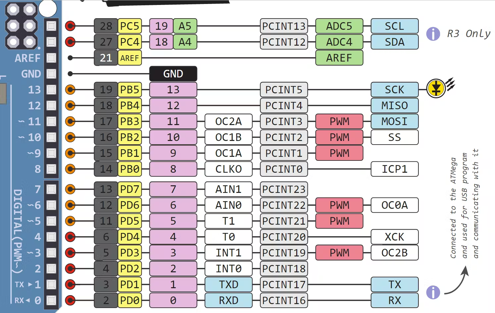
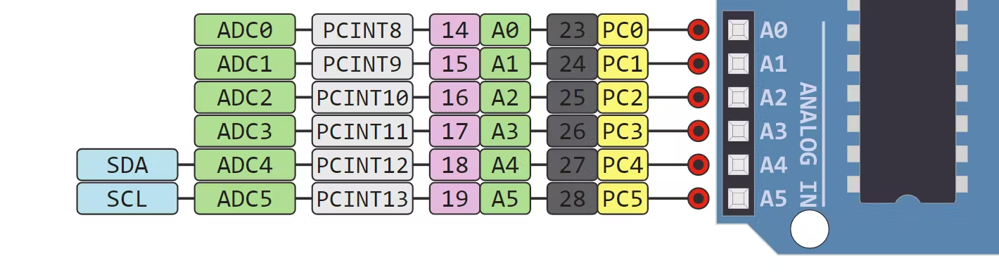

Arduino
=======

We use Arduino as our starting point to learn to use new components given Arduino's 
simplicity and easy use. 

Below is the pinout on the right and left side of an arduino. As mentioned in the SPI section there are specific pins for using SPI communication. 

.. _arduinoPinout:

.. div:: sd-text-center
    
   Right Side / Digital Side

.. div:: sd-text-center

   Left Side / Analog Side

You do not need to memorize these diagram!

.. _installation:

Installation
------------

Follow the following instruction to install Arduino on your laptop / PC

.. tabs::

   .. tab:: Windows
   
      #. Download Arduino
               
         Go to the following `link <https://www.arduino.cc/en/software>`_

      #. Run Installer

         Click the .exe file

   .. tab:: Linux

      #. Install

         Run the following inside of the terminal

         .. code-block:: Bash

            $ sudo apt update
            $ sudo apt install arduino

         OR

         .. code-block:: Bash

            $ sudo snap install arduino

.. _tutorial:

To-Do
-----
The following are excersives to show that you have the basic amount of experience with Arduino to use
it to test different sensors that could be implement into the exoskeleton suit. 

The answers tab is provided to so that you can see a working version of the to-do's. 

.. tabs::

   .. tab:: To-Do

      [ ] Turn on the onboard LED
      
      [ ] Blink the onboard LED on and off with a 2 second period and a 50% duty cycle

   .. tab:: Hints
      
      - Duty Cycle = percentage of time the LED if HIGH
      - Period = time required for LED to repeat from start to finish

   .. tab:: Answers

      This is not the only solution to this exercise as programming is very open ended.

      .. code-block:: C++

         void setup(){

         }

         void loop(){

         }
