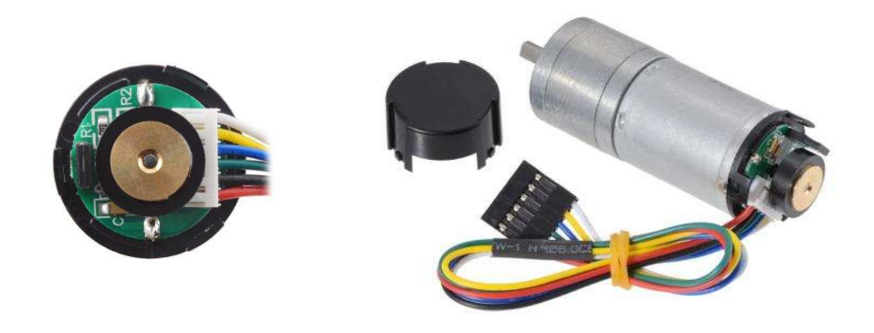
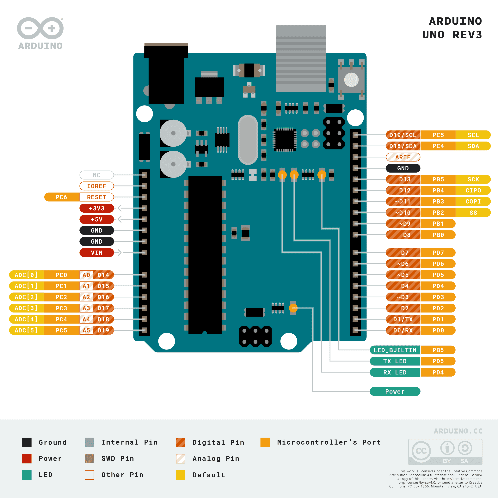
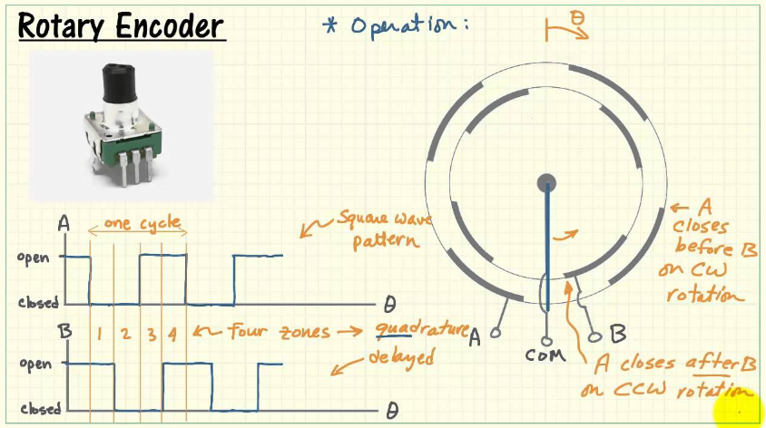
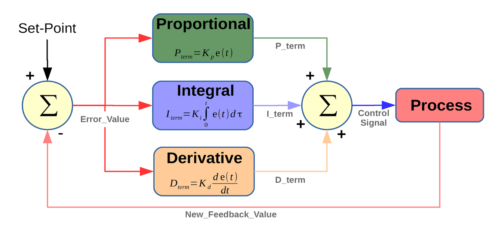

Motor Controller Challenge
==========================

Overview
--------

Objective: Create a position controlled motor controller

In this challenge, we will create a position controlled motor controller. We will be controlling the Pololu 25d HP12 gear motor. 

This training includes both electrical and programming components.

.. note::

   Programmers: Knowing the electrical components and wiring diagrams are beneficial when it comes to debugging

Electrical
----------

Objective: Familiarize yourself with reading datasheets and basic wiring.

This is the list of materials you will need:
   * Arduino R3 Uno
   * Breadboard
   * Jumper Wires
   * Pololu 12V HP Motor
   * Motor Driver **(you need to figure this out)**
   * Power Supply

**1. Find the motor driver**
~~~~~~~~~~~~~~~~~~~~~~~~~~~~

We have included datasheets in this `folder <https://drive.google.com/drive/folders/1xZB-TVaK-d6UKZDr4bEafMfK2vxhbZi5?usp=sharing>`_ for various motor drivers and the Pololu Motor. Our LEXO uses a 24V LiPo battery. We won’t be using the 24V battery to power our system for testing purposes, but for the sake of this part let’s pretend we are. Using this information, you should determine which motor driver is needed based on the voltage of the battery and current of the motor.

.. dropdown:: Hint 1
   Test content

**Safety**
~~~~~~~~~~

When dealing with electrical components it is always important to practice safety. If you are unsure of something, ask **questions!** This is not an exam.

DO NOT
   - Connect Ground and Voltage wires
   - Touch Ground and Voltage wires when the cirucit is powered
   - Let High current (more than 5A) continually flow through circuit

DO
   - Look at the datasheets
   - Double check connections

**Testing Motor**
~~~~~~~~~~~~~~~~~

Now we will test the motor just to make sure that it is operational. Power your Arduino with a laptop or PC, and connect the motor GND (black) to an Arduino GND pin using a jumper wire. Then connect the motor power (red) to the Arduino 5V. Does the motor spin? If yes we can continue to the next part.

**Wiring**
~~~~~~~~~~

Now let’s begin to wire all the components together. There is an included Arduino pinout above. Disconnect the motor GND and motor power from the arduino. Route a wire from the negative terminal on the breadboard to the GND on the arduino. Do the same for the positive terminal and 5V. We will route most GND and Voltage connections to these terminals.

Connect the motor GND and power to the motor driver MA and MB respectively. Connect the motor Encoder A and Encoder B wires to two digital pins on the arduino. Wire the Encoder Vcc to the 5V terminal.

The motor drive should have three outputs labeled GND, PWM, and DIR. Connect GND to the GND terminal. Connect PWN and DIR to digital pins on the arduino. Make sure the PWM pin is marked with a "~" next to the number.

Lastly connect a thick GND wire to the motor driver VB- and a power wire to VB+.

**Testing Circuit**
~~~~~~~~~~~~~~~~~~~

**Have someone double check all the connections before connecting the VB- and VB+ to the power supply!**

Once everything looks good, plug in the power supply and turn it on to make sure that it is 12V. Power it off and connect the VB- and VB+ wires to GND and power on the power supply with the alligator clips. Turn on the power supply.

There are two buttons on the motor driver labeled MA and MB. Press one at a time to spin the motor in a direction. Make sure the motor is able to spin both directions. If it’s hard to tell the direction, you can just put a piece of electrical tape on the part that spins.

Programming
-----------

This part of the training will familiarize you with the basics of PID controllers, rotary encoders and Arduino.

**Learn Encoders**
~~~~~~~~~~~~~~~~~~

A rotary encoder is a type of sensor that alternates between high and low voltage (example 5V and 0V). If you check the motor data sheet, you will see there are two encoders. Each encoder will alternate between high and low when you spin the motor. The direction that the motor spins can be determined by which encoder switches voltage first. `Here <https://www.youtube.com/watch?v=CpwGXZX-5Ug.>`_ is a useful video that explains encoders in simple terms.

**Testing Encoder**
~~~~~~~~~~~~~~~~~~~

Let’s test if the rotary encoder is working using the :download:`TestEncoder <./code/TestEncoder.ino>` file. Download the program and open it in Arduino. 

Make sure to define ENCA as pin 2 and ENCB as pin 3. Once that’s done, verify and upload the program then open the serial monitor (Tools > Serial Monitor). Rotate the encoder left and right to see if the two values change, if they do then the encoder should be working. Another test you can try is to use the serial plotter instead of the serial monitor to see the graphs of the encoders.

**Testing Position Control**
~~~~~~~~~~~~~~~~~~~~~~~~~~~~

Next we will test if we can record position using the encoder. Download the :download:`TestPosition <./code/TestPosition.ino>` and open it in Arduino. Repeat the process for defining ENCA and ENCB. Verify and upload the program then run the serial monitor again. When you spin the encoder the position should increase or decrease depending on the direction it’s turned. If this happens then we know we’re able to read the position correctly.

**Learning PID**
~~~~~~~~~~~~~~~~

A common way to control motors is by using a PID controller. In simple terms, a PID controller is a looping system that tries to achieve some set value by the user. For example, if you are in a car and have cruise control set to 60mph, but you start going down or uphill. A PID controller is used to account for those differences to make sure the car keeps the set target of 60mph. `Here <https://www.youtube.com/watch?v=UR0hOmjaHp0>`_ is a brief video to better explain the topic and math.

PID controllers are a standard control algorithm in multiple industries. We will be using a PID controller in the next section to control the motor more precisely beyond just spinning forward and backward. 

**Writing PID Controller**
~~~~~~~~~~~~~~~~~~~~~~~~~~

Download the :download:`SetMotorTest <./code/SetMotorTest.ino>` and open it in Arduino. You will need to define the pins you used for ENCA, ENCB, PWM, and DIR. Make sure you have PWM connected to a digital pin that is marked with a "~". Uncomment and write the code to produce the proportional, integral, derivative, and control signal. 

**Testing PID Controller**
~~~~~~~~~~~~~~~~~~~~~~~~~~

Lines 30-32 have the PID constants that you will need to adjust to hit the target on line 26. Try adjusting the PID constants until you are able to hit the target without overshoot or oscillation. You will need to connect the power supply to the motor GND and power and VB+ and VB- again for this step and the next step.

**Calibrating PID Controller**
~~~~~~~~~~~~~~~~~~~~~~~~~~~~~~

Once you are able to hit the constant target, you should try a target that changes over time. Comment out line 26 and uncomment line 27. Repeat the steps you took in part V to make sure you can match the sinusoid as closely as possible without oscillation or overshoot. After this step you will have successfully controlled a motor. **Congratulations!**
