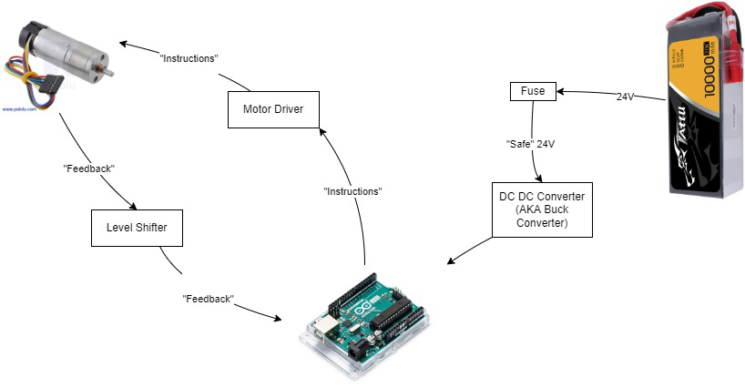

Motor Controller Challenge
==========================

Table of Content
----------------

.. toctree::
   :caption:

   nameeeeeeeeee

Overview
--------

Objective: Create a position controlled motor controller

In this challenge, we will create a position controlled motor controller. We will be controlling the Pololu 25d HP12 gear motor. 

.. image:: assets/pololu25d.png
   :width: 400
   :align: center

The diagram below shows a high level diagram of what you will be doing in this training. As you can see by the diagram this training includes both electrical and programming components.

.. note::

   Programmers: Knowing the electrical components and wiring diagrams are beneficial when it comes to debugging

This diagram shows the 'bare-bones' components that you will be using.  You could include more components if you want/need, but a simple position controller can be made with the components below:

The base electrical components are the following:
   * Power Source
      - LiPo battery
      - Power supply (safer since it has internal current limits)
   * Fuse
      - **YOU WILL NEED TO FIGURE THIS OUT**
   * Microcontroller
      - Arduino
   * Motor Driver
      - **YOU WILL NEED TO FIGURE THIS OUT**
   * Motor + Encoder
      - Pololu 25d HP12 gear motor and its encoder

Electrical
----------

Objective: Familiarize yourself with reading datasheets and basic wiring.

**I. Find the motor driver**
This is the list of materials you will need:
   * Arduino R3 Uno
   * Breadboard
   * Jumper Wires
   * Pololu 12V HP Motor
   * Motor Driver
   * Power Supply

We have included datasheets in this folder for various motor drivers and the Pololu Motor. Our LEXO uses a 24V LiPo battery. We won’t be using the 24V battery to power our system for testing purposes, but for the sake of this part let’s pretend we are. Using this information, you should determine which motor driver is needed based on the voltage of the battery and current of the motor.

**II. Safety**
When dealing with electrical components it is always important to practice safety. If you are unsure of something, ask **questions!** This is not an exam.

DO NOT
   - Connect Ground and Voltage wires
   - Touch Ground and Voltage wires when the cirucit is powered
   - Let High current (more than 5A) continually flow through circuit

DO
   - Look at the datasheets
   - Double check connections

**III. Testing Motor**
Now we will test the motor just to make sure that it is operational. Power your Arduino with a laptop or PC, and connect the motor GND (black) to an Arduino GND pin using a jumper wire. Then connect the motor power (red) to the Arduino 5V. Does the motor spin? If yes we can continue to the next part.

**IV. Wiring**
.. image:: assets/arduino_pinout.png
   :width: 400
   :align: center

Now let’s begin to wire all the components together. There is an included Arduino pinout above. Disconnect the motor GND and motor power from the arduino. Route a wire from the negative terminal on the breadboard to the GND on the arduino. Do the same for the positive terminal and 5V. We will route most GND and Voltage connections to these terminals.

Connect the motor GND and power to the motor driver MA and MB respectively. Connect the motor Encoder A and Encoder B wires to two digital pins on the arduino. Wire the Encoder Vcc to the 5V terminal.

The motor drive should have three outputs labeled GND, PWM, and DIR. Connect GND to the GND terminal. Connect PWN and DIR to digital pins on the arduino. Make sure the PWM pin is marked with a "~" next to the number.

Lastly connect a thick GND wire to the motor driver VB- and a power wire to VB+.

**V. Testing Circuit**
**Have someone double check all the connections before connecting the VB- and VB+ to the power supply!**

Once everything looks good, plug in the power supply and turn it on to make sure that it is 12V. Power it off and connect the VB- and VB+ wires to GND and power on the power supply with the alligator clips. Turn on the power supply.

There are two buttons on the motor driver labeled MA and MB. Press one at a time to spin the motor in a direction. Make sure the motor is able to spin both directions. If it’s hard to tell the direction, you can just put a piece of electrical tape on the part that spins.

Programming
-----------

This part of the training will familiarize you with the basics of PID controllers, rotary encoders and arduino

**I. Learn Encoders**
A rotary encoder is a type of sensor that alternates between high and low voltage (example 5V and 0V). If you check the motor data sheet, you will see there are two encoders. Each encoder will alternate between high and low when you spin the motor. The direction that the motor spins can be determined by which encoder switches voltage first. `Here <https://www.youtube.com/watch?v=CpwGXZX-5Ug.>`_ is a useful video that explains encoders in simple terms

