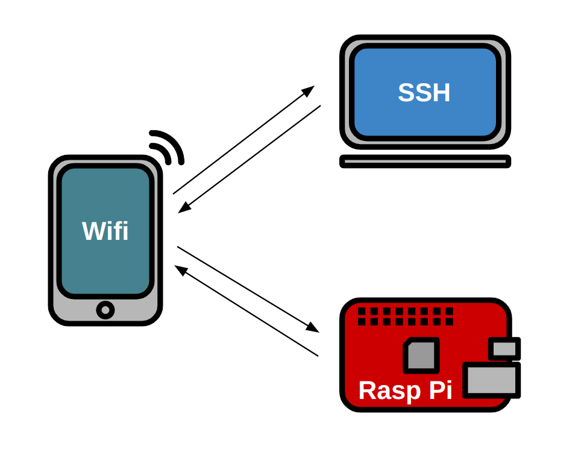

Raspberry Pi
============

We use Raspberry Pi for our main microcontroller on the final products as it has more computing power. 

Below is the pinout of the Raspbery Pi 4.

.. _raspberrypiPinout:

.. image:: assets/raspberry_pi_pinout.png
   :width: 500
   :align: center

.. _flashing:

OS Flashing
------------

Raspberry Pi released an imaging tool which simplifies the process of flashing an OS into 
a micro SD card. If you do not have a micro SD card reader then use an adapter.

.. tabs::

   .. tab:: Windows
      
      #. Download RPi Imager

         Go to the following `link <https://www.raspberrypi.com/software/>`_

      #. Run Installer

         Click the .exe file

   .. tab:: Linux

      #. Download RPi Imager

         Go to the following `link <https://www.raspberrypi.com/software/>`_

      #. Run Installer

         Run the following inside of the terminal

         .. code-block:: Bash

            $ cd ~/Downloads/
            $ sudo apt install ./imager_<version>_amd64.deb

   
.. _installation:

Installing Tools
----------------

At STARX we use use a variety of tools this inclues ROS, odrive, SPI, GPIO, Git, and more. Use the following lines and follow the installation instructions for the tool that you will be using so that the raspberry pi is ready to be used to test and work on anything related to STARX.

.. _headless:

Headless
--------

A headless raspberry requires no monitor to make changes, instead we remotely connect to it and make changes using a laptop. This is important during competition as we do not have the space or time to setup an environment for a raspberry pi.

This requires 3 different devices: hotspot, raspberry pi, and laptop

Hotspot
~~~~~~~

.. tabs::

   .. tab:: Apple

      #. Settings > About

         Name: starx

      #. Settigs > About > Personal Hotspot

         Password: joyride67

      #. Enable hotspot

   .. tab:: Android

      #. Settings > Connections > Mobile Hotspot and Tethering > Mobile Hotspot

         Network name: starx

         Password: joyride67

      #. Enable hotspot

Raspberry Pi
~~~~~~~~~~~~

.. tabs::

   .. tab:: Option 1

      #. Google Drive > STARX > PROGRAMMING Team 
               
         Download the custom STARX Ubuntu image: starx_ubuntu.img.zip
               
      #. Unzip image
               
         .. code-block:: Bash
   
            $ unzip starx_ubuntu.img.zip

      #. Flash custom starx ubuntu image

         Open the Raspberry Pi Imager > CHOOSE OS > Use custom

   .. tab:: Option 2

      #. Run the following commands to install necessary application

         .. code-block:: Bash

            $ sudo apt install openssh-server

      #. The following commands checks the status of the ssh service

         .. code-block:: Bash

            $ sudo systemctl status ssh

      #. Ubuntu uses ufw to control firewall permission, we must allow ssh connections

         .. code-block:: Bash

            $ sudo ufw allow ssh

      #. Connect to starx wifi so that it creates the wifi profile and automatically connects

Laptop
~~~~~~

.. note::

   The following will work for both Ubuntu and VM Ubuntu. VM Ubuntu MUST have the Network Adapter set to "Bridged Adapter"

Install the following tools to find the raspberr pi's IP address.

.. code-block:: Bash

   $ sudo apt install net-tools
   $ sudo apt install nmap

We wil use two commands to discover the raspberry pi's IP as it it dynamically assigned. The following will print the gateway's IP address.

.. code-block:: Bash

   $ arp -a

   Example Output: 192.168.20.53

We will use this IP to do a wifi scan, this will find every device connected to this wifi

.. code-block:: Bash

   $ nmap -sP <gateway's ip (first 3 values)>.1/24

   Example Input: nmap -sP 192.168.20.1/24

This should take a couple of seconds and should print three different IP's: gateway, laptop, and raspberry pi

Use the raspberry pi IP to ssh into the pi.

.. code-block:: Bash

   $ ssh starx@raspi-IP

