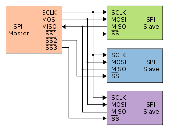

SPI
===

.. _preview:

What is SPI?
------------

SPI is a communication protocol, it allows devices to communicate in a full-duplex mode 
(bidirectional) with one device serving as the Master and every other device as the Slave. Bidirectional means that the device can both recieve and send information at the same time. In contrast, a very popular communication method I2C is half-duplex as it can only either receive or send data at a single point in time. 

It is possible that the pins get labeled with different but similar names:

* SCLK = Serial Clock
* MOSI = Master Out Slave In
* MISO = Master In Slave Out
* SS# = Slave Select 

It is not important that you know the following but make sure that you are using the proper mode for the component that you will be using. 

SPI Modes
   Non-inverted clock polarity (SCLK is low when SS transitions to low)
   
   * Mode 0: Data is sampled on rising edge and shifted out on falling edge
   * Mode 1: Data is sampled on falling edge and shifted out on rising edge

   Inverted clock polarity (SCLK is high when SS transitions to high)
   
   * Mode 2: Data is sampled on falling edge and shifted out on rising edge
   * Mode 3: Data is sampled on rising edge and shifted out on falling edge

Some devices will have pins that are specifically for SPI communication so make sure to look up the pinout of the device that you are using (arduino, raspberry pi, etc).

.. _installation:

Library Installation and Usage
------------------------------

.. tabs::
   
   .. tab:: Python (Linux)
  
      #. To install we need to update the package information for all available sources

         .. code-block:: Bash
   
            $ sudo apt update

      #. This will install pip3 and the python3 developer tools

         .. code-block:: Bash

            $ sudo apt install python3-pip python3-dev -y

      #. Instal spidev library

         .. code-block:: Bash   
      
            $ pip3 install spidev -y

      #. Test that the install was succesful by running the following on the terminal

         .. code-block:: Bash

            $ python3

            >>> import spidev

   .. tab:: C++

      For C++ we have aquired our own libraries

      #. Clone our SPI library repository

         .. code-block:: Bash

            $ git clone https://gitlab.eecs.umich.edu/starx/spi.git

      #. Import the library into the C++ file

         .. code-block:: C++

            #include "library-name.h"

   .. tab:: Arduino C++

      Arduino includes its own SPI library

      #. Import the library into the arduino file

         .. code-block:: C++

            #include <SPI.h>

.. _enable:

Enabling
--------

Some devices (Arduino does not) require you to enable SPI mode. To enable SPI mode: 

.. tabs::

   .. tab:: Raspbian
      
      #. Use Raspi-config
         
         .. code-block:: Bash

            $ sudo raspi-config

      #. Select Interfacing Options

      #. Select SPI

      #. Activate <Select>

      #. Activate <Yes>

      #. Reboot

